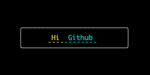

# temir-link

> Link component for Temir. 

## Install

```
$ npm install @temir/link
```

## usage



```vue
<script lang="ts" setup>
import { TBox, TText } from '@temir/core'
import TLink from '@temir/link'
</script>

<template>
  <TBox
    :margin="5"
    width="20"
    border-style="round"
    justify-content="center"
  >
    <TLink url="https://github.com">
      <TText color="yellow">
        Hi
      </TText>
      <TText color="cyan">
        Github
      </TText>
    </TLink>
  </TBox>
</template>

```

## API

### `<TLink>`

[Supported terminals.](https://gist.github.com/egmontkob/eb114294efbcd5adb1944c9f3cb5feda)

For unsupported terminals, the link will be printed in parens after the text: `Link`.

#### url

Type: `string`

The URL to link to.

#### fallback

Type: `boolean`\
Default: `true`

Determines whether the URL should be printed in parens after the text for unsupported terminals: `Link`.

## Related

- [terminal-link](https://github.com/sindresorhus/terminal-link) - Create clickable links in the terminal

- [ink-link](https://github.com/sindresorhus/ink-link) - Link component for Ink
